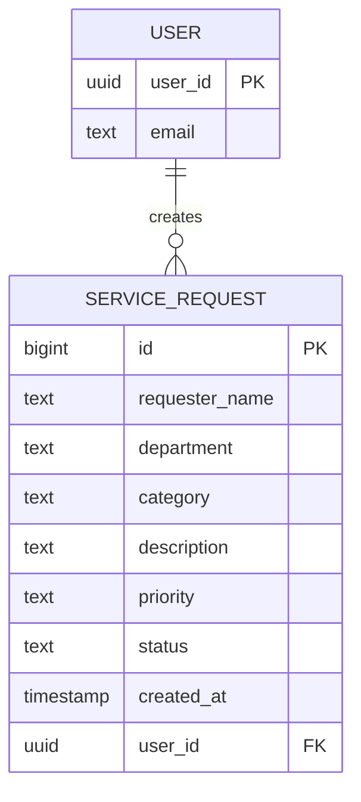

# SAD-ServiceRequest-DelosReyes

**Student:** [Princess Icy D. Delos Reyes]  
**Section:** [BSIT 3A]  
**Course:** Systems Analysis and Design (SAD)  

## Live System

**GitHub Repository:** https://github.com/your-username/SAD-ServiceRequest-DelosReyes  
**GitHub Pages:** https://your-username.github.io/SAD-ServiceRequest-DelosReyes/  

## Problem Statement

The university ICT office receives technical concerns through verbal requests, text messages, and social media. Because requests come from different channels, some concerns are forgotten, duplicated, or not properly monitored. This Service Request Management System allows authorized users to record, track, and manage technical support requests through a centralized web-based platform.

## Use Case Diagram

```mermaid
usecaseDiagram
    actor User
    User --> (Login)
    User --> (View Dashboard)
    User --> (Create Request)
    User --> (View Requests)
    User --> (Search Request)
    User --> (Filter Requests)
    User --> (Update Request)
    User --> (Delete Request)
    User --> (Logout)
```

## Entity-Relationship Diagram



## Requirements Traceability Matrix

| Req. ID | Requirement | System Feature | Test |
|---------|-------------|----------------|------|
| FR-01 | User can log in | Login Page | TC-01 |
| FR-02 | User can create request | Request Form | TC-02 |
| FR-03 | User can view requests | Request Table | TC-03 |
| FR-04 | User can update request | Edit Function | TC-04 |
| FR-05 | User can delete request | Delete Function | TC-05 |
| FR-06 | User can search | Search Function | TC-06 |
| FR-07 | User can filter | Filter Function | TC-07 |
| FR-08 | System displays summaries | Dashboard | TC-08 |

## Functional Test Cases

| Test ID | Test Scenario | Expected Result | Status |
|---------|---------------|-----------------|--------|
| TC-01 | Login using valid account | Dashboard appears | PASS |
| TC-02 | Submit valid request | Request saved | PASS |
| TC-03 | Display requests | Existing records appear | PASS |
| TC-04 | Modify request | Changes saved | PASS |
| TC-05 | Delete request | Confirmation appears and record is removed | PASS |
| TC-06 | Search requester | Matching records displayed | PASS |
| TC-07 | Filter Pending requests | Only Pending records displayed | PASS |
| TC-08 | Open deployed URL | Application loads online | PASS |

## Database Setup (Supabase)

Execute the following SQL in the Supabase SQL Editor:

```sql
CREATE TABLE service_requests (
    id BIGINT GENERATED BY DEFAULT AS IDENTITY PRIMARY KEY,
    requester_name TEXT NOT NULL,
    department TEXT NOT NULL,
    category TEXT NOT NULL,
    description TEXT NOT NULL,
    priority TEXT NOT NULL,
    status TEXT DEFAULT 'Pending',
    created_at TIMESTAMPTZ DEFAULT NOW(),
    user_id UUID REFERENCES auth.users(id)
);

ALTER TABLE service_requests ENABLE ROW LEVEL SECURITY;

CREATE POLICY "Authenticated users can view requests" ON service_requests
    FOR SELECT TO authenticated USING (true);

CREATE POLICY "Authenticated users can insert requests" ON service_requests
    FOR INSERT TO authenticated WITH CHECK (auth.uid() = user_id);

CREATE POLICY "Authenticated users can update requests" ON service_requests
    FOR UPDATE TO authenticated USING (auth.uid() = user_id);

CREATE POLICY "Authenticated users can delete requests" ON service_requests
    FOR DELETE TO authenticated USING (auth.uid() = user_id);
```

## Configuration

1. Create a `js/supabase.js` file with your Supabase project URL and publishable key:

```javascript
const SUPABASE_URL = "https://your-project.supabase.co";
const SUPABASE_KEY = "your-publishable-key";
```

2. Enable Email authentication in Supabase Dashboard > Authentication > Providers.

3. Deploy to GitHub Pages via Settings > Pages > Build and Deployment > Deploy from a branch > main.

## Security Notes

- Only the client-safe publishable key is used in front-end code.
- Row Level Security (RLS) ensures users can only modify their own records.
- The `service_role` key is never exposed in client-side code.
